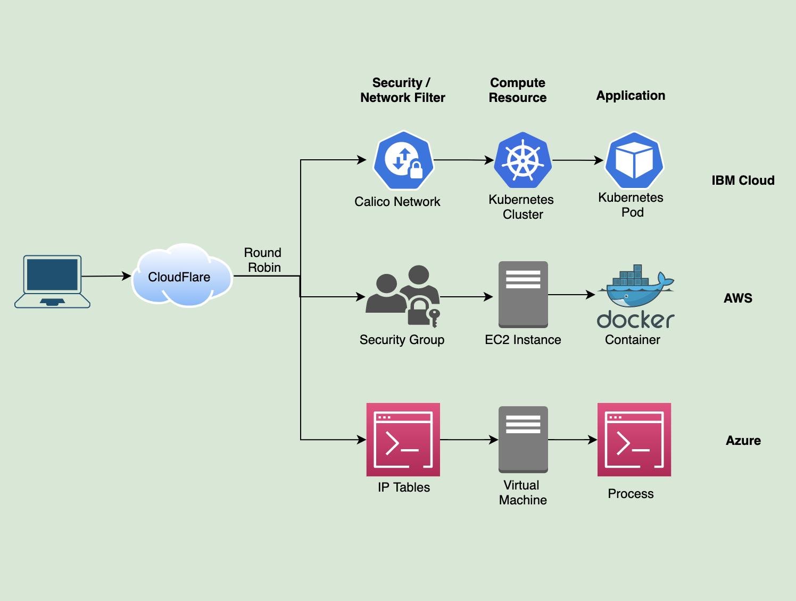

# Infrastructure as code for personal site
This repo contains all code needed to create the infrastructure and application deployment for [djsharma.xyz](https://djsharma.xyz). The goal is to host this personal site as cost effective as possible in multiple clouds using multiple technology stacks and use a highly avaiable proxy as the entry point for the user. The total cost of the site is $9.34 which was to buy the domain djsharma.xyz for 2 years.



## Notable Points
1. **End to end encryption**
- User connects to CloudFlare proxy which terminates TLS
- CloudFlare connects to origin(s) which use self signed certificates
2. **Network Filtering only allows CloudFlare to connect to origin(s)**
- Use of security groups to restrict connections only from CloudFlare on AWS EC2 instance
- Use of calico to restrict connections only from CloudFlare on IKS Cluster
- Use of IP talbes to restrict connections only from CloudFlare on Azure VM
3. **AWS**
- VPC
- VPC Subnets
- Security Groups
- Routing Table
- Internet Gateway
- EC2 Instance with cloud init script
- Docker
4. **IBM Cloud**
- Kuberentes Cluster
- Calico 
- Kubernetes Resources (namespace, configmap, deployment)
5. **Azure**
- Resource Group
- Virtual Network
- Subnet in Virtual Network
- Linux Virtual Machine with cloud init script
- Linux Uncomplicated Firewall (ufw)
- Nginx
6. **CloudFlare**
- DNS Hosting
- Website Proxy 

## Environment Variables 
This is the list of variables that need to be set for terraform to run
```
# cloudflare
CLOUDFLARE_API_KEY=
CLOUDFLARE_EMAIL=
CLOUDFLARE_API_USER_SERVICE_KEY=

# aws
AWS_ACCESS_KEY_ID=
AWS_AWS_SECRET_ACCESS_KEY=

# ibm cloud
IC_API_KEY=

# Azure
# Login to the cli since running locally: 
# https://registry.terraform.io/providers/hashicorp/azurerm/latest/docs/guides/azure_cli
```

## Prerequisite
1. Update the `tf_files/publickey.crt` with the public key to add to servers
2. [Free Tier AWS Account](https://aws.amazon.com/free/)
3. [Free Tier CloudFlare Account](https://www.cloudflare.com/plans/)
4. [Free Teir IBM Cloud Account](https://www.ibm.com/cloud/free)
5. [Free Teir Azure Account](https://azure.microsoft.com/en-us/free/)
6. Ownership of a domain- djsharma.xyz in this case

## Delegate DNS to CloudFlare
We will be using CloudFlare to configure DNS, and to act as a proxy. Either buy a domain directly from CloudFlare or delegate the domain to them via NS records on your authority.

## Considerations
1. CloudFlare is not load balancing between the different origins as this would cost monthly. CloudFlare is only using round robin via the multiple a-records but does not check the health of the endpoints.
2. This project is meant to show infrastructure as code and not meant for application deployment. Normally CI/CD (ie Jenkins) would be used of application deployment, but in this case we get the application deployed via simple scripts and do not manage the lifecyle. In this specific case it is often easier to delete the Infrastructure (ie Kubernetes deployment, EC2 instance) and have terraform reapply it vs trying to patch the application.
